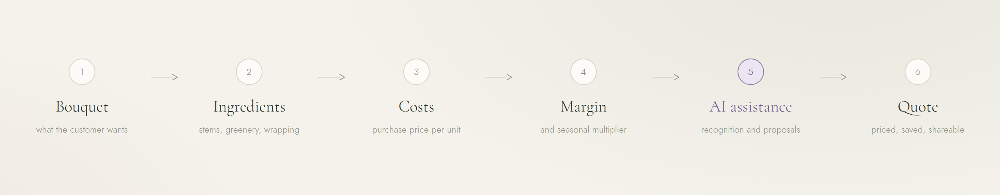
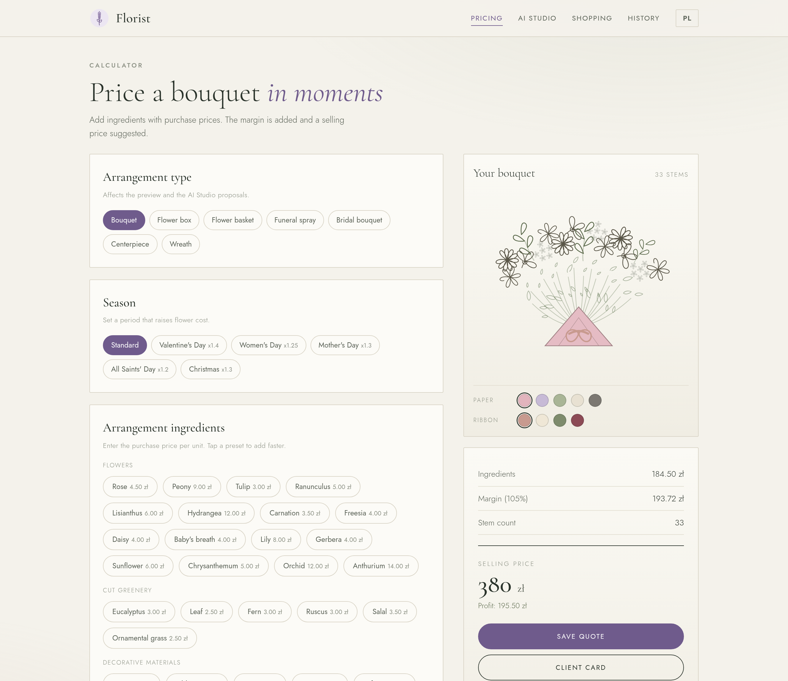
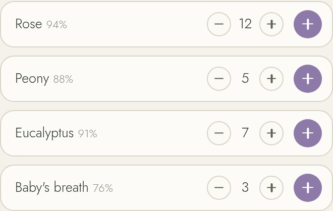
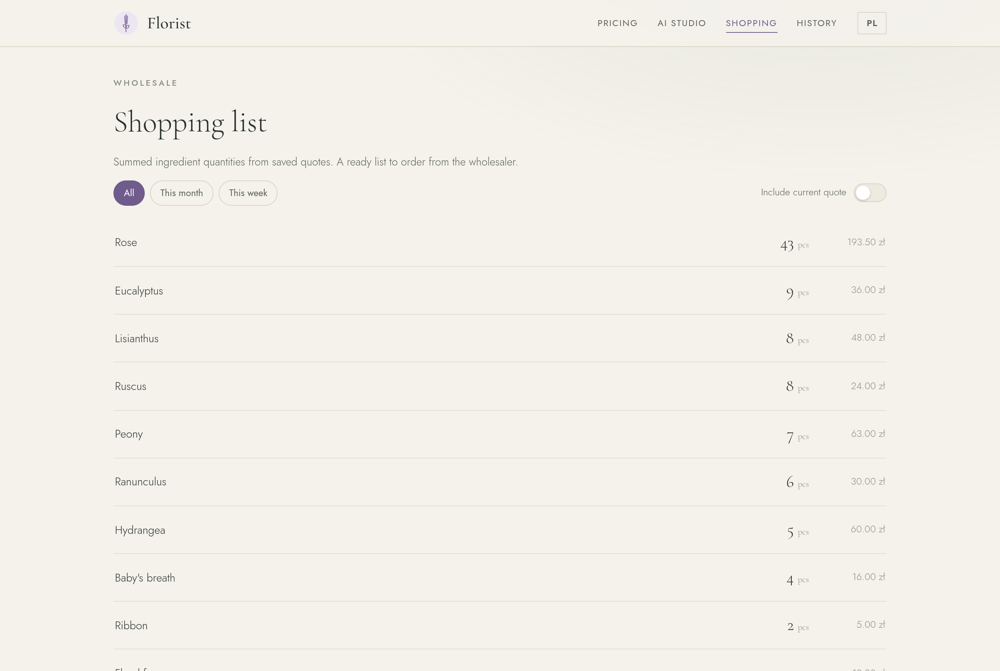
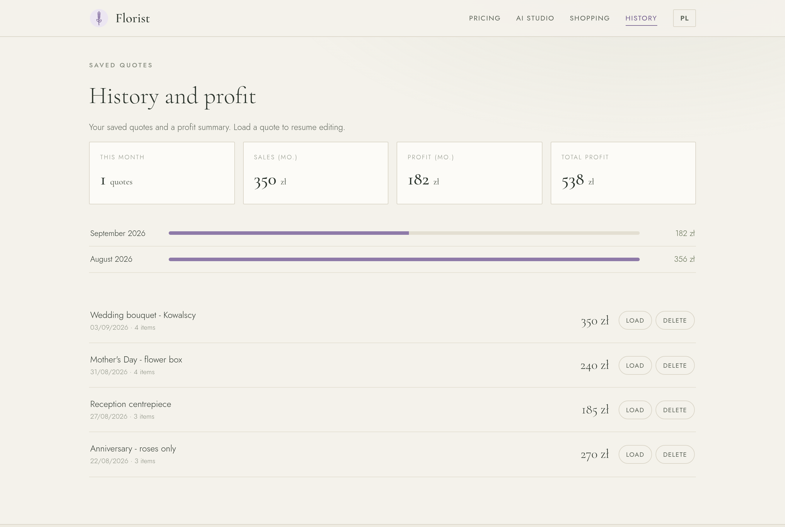
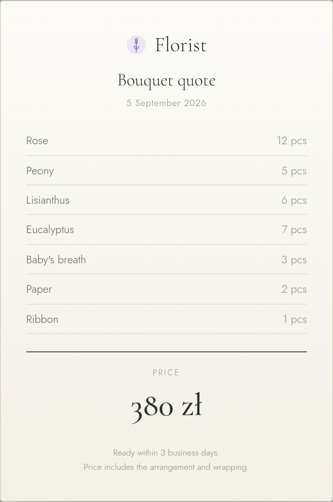
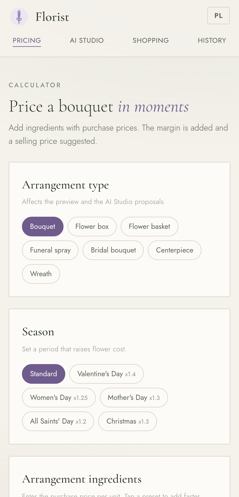
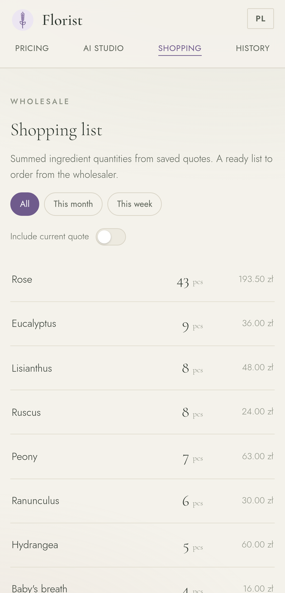

<picture>
  <source media="(prefers-color-scheme: dark)" srcset="assets/brand/banner-dark.png">
  
</picture>

<p align="center">
  <a href="https://github.com/Marcin1000/Florist/actions/workflows/ci.yml"></a>
  
  
  
</p>

# Florist

**AI-assisted pricing and workflow tool for florists.**

Helping florists price bouquets, prepare quotes and manage ingredient costs faster.

---

## The problem

Pricing a bouquet is arithmetic done under time pressure, usually while a customer is
standing at the counter.

- **The maths is done in the head or on paper.** Count the stems, multiply each by its
  purchase price, add the wrapping, apply a margin, round to something presentable.
  Every bouquet, every time.
- **Prices move with the season.** Valentine's Day, Women's Day, Mother's Day and All
  Saints' Day all shift wholesale costs. The uplift is usually applied by feel, and the
  feel is not consistent from one week to the next.
- **Quotes get revised.** A customer changes the flowers, the colour or the size, and the
  whole calculation starts again from the beginning.
- **Ordering is a second, separate calculation.** Several quotes for the coming week have
  to be merged by hand into one wholesale order.
- **Nothing is written down.** What was quoted, at what margin, with what profit - gone as
  soon as the customer leaves.
- **Unfamiliar plants.** A customer arrives with an inspiration photo containing flowers
  that need to be named before they can be priced.

None of this is difficult work. It is repetitive work, and it happens while the shop is
busy - which is exactly when arithmetic errors turn into lost margin.

## The solution

One flow, from what the customer asks for to a priced quote:

<picture>
  <source media="(prefers-color-scheme: dark)" srcset="assets/brand/flow-dark.png">
  
</picture>

Pick the arrangement type and season, add ingredients from presets or by hand, set the
margin. The selling price, the stem count and a line drawing of the arrangement update as
you type. When the quote is right, it is saved, shown to the customer as a clean card, or
printed to PDF.



## AI capabilities

The AI is optional. The calculator, the shopping list and the history all work without it
and without a network connection.

| | |
|---|---|
| **Plant recognition** | Photograph the flowers a customer brought, or the materials on the bench. Recognised plants come back named, counted and with a confidence score - then go straight into the quote as priced ingredients. |
| **AI Studio** | Describe an idea in plain language, or start from a photo, and get three bouquet proposals for the chosen arrangement type. |
| **Suggestions** | Recognised ingredients carry over into pricing, so a photo becomes a costed quote without retyping anything. |

<p align="center">
  
</p>

Recognition and generation call the OpenAI API with a key the florist enters in the app.
The key is stored locally on the device and never leaves it except in requests to OpenAI.

## Product capabilities

- **Pricing** - purchase price per unit, quantities, live totals, price rounding.
- **Margins** - a margin slider with a seasonal multiplier for the periods that actually
  move wholesale prices.
- **Composition preview** - the bouquet is drawn as SVG from the ingredients themselves:
  stem counts, flower shapes, paper and ribbon colours.
- **Shopping list** - ingredients summed across saved quotes into one wholesale order,
  filtered by period and exportable to CSV.
- **Quote history** - every saved quote with its cost, margin and profit, ready to be
  loaded back and revised.
- **Customer-facing quote card** - a clean summary to show on screen, print, or save as PDF.
- **Two languages** - Polish and English, switchable in the header.

<table>
<tr>
<td width="50%"></td>
<td width="50%"></td>
</tr>
<tr>
<td align="center"><em>Shopping list, summed across quotes</em></td>
<td align="center"><em>History, with margin and profit</em></td>
</tr>
</table>

<p align="center">
  
  <br>
  <em>What the customer sees - printable, or saved as PDF</em>
</p>

## Platform

**Windows · macOS · Android · iOS**

The whole application is a single HTML file that runs offline, with the fonts embedded in
it. Each platform is a thin native shell around that one file, so every device shows the
same product.

| Platform | Shell | Output |
|---|---|---|
| Windows | Electron | NSIS installer and a portable `.exe` |
| macOS | Electron | universal `.dmg` (Apple Silicon and Intel) |
| Android | Kotlin, WebView | `.apk`, Android 10+ |
| iOS | SwiftUI, WKWebView | iPhone and iPad, iOS 15+ |

Native shells add what a web page cannot do on its own: the camera and photo picker,
saving files through the system dialog or share sheet, the native clipboard, and durable
local storage.

<p align="center">
  
  
</p>

## Product status

**Early product / real-world validation.**

The application is complete and shipping on all four platforms: pricing, AI Studio,
shopping list and history all work end to end, and the build for each platform is
documented and reproducible. What is not settled yet is the product question - whether it
measurably changes how a florist works during a busy day. That is what the current stage
is for.

Not built yet, and deliberately so: no accounts, no hosted service, no multi-shop or
multi-user support. Data lives on the device.

## Validation

Two numbers decide whether this is worth continuing. Both are being measured now; this
table is filled in from real use, not estimates.

| KPI | What it means | Current |
|---|---|---|
| **Time to Quote** | Minutes from a customer's request to a finished, priced quote - measured against the same task done by hand. | *measurement in progress* |
| **Number of quotes created** | Quotes actually saved in day-to-day work, as a signal that the tool is used when the shop is busy, not only when it is quiet. | *measurement in progress* |

## Getting started

Try it in a browser - no install, no build step, no server:

```bash
git clone https://github.com/Marcin1000/Florist.git
cd Florist
open app/index.html        # macOS
start app\index.html       # Windows
xdg-open app/index.html    # Linux
```

To build a native application for a platform, follow its guide:
[Windows](docs/WINDOWS.md) · [macOS](docs/MACOS.md) · [Android](docs/ANDROID.md) ·
[iOS](docs/IOS.md).

## For developers

The app is one file, `app/index.html`, with no bundler, no framework and no runtime
dependencies. Copies for the platform shells are generated, not committed. Tests run the
real application in Chromium and cover the parts that are easy to break silently.

See **[docs/DEVELOPMENT.md](docs/DEVELOPMENT.md)** for the repository layout, the working
loop, the test suite and the conventions this codebase follows.

```bash
npm install
npm test
```

## License

**[PolyForm Noncommercial 1.0.0](LICENSE)** © 2026 Marcin Przybylski

Free to use, study, modify and share for **any noncommercial purpose**: personal use,
hobby projects, learning, research and teaching, and use by charities, schools, public
research bodies, health, environmental and government organisations.

**Running a flower business on it is commercial use, and needs a separate licence from
the author.** So does selling Florist or anything derived from it. That licence is the
product - if you want one, open an issue on this repository and we will sort it out.

The full terms are short and readable; the summary above is a summary, not the licence.
